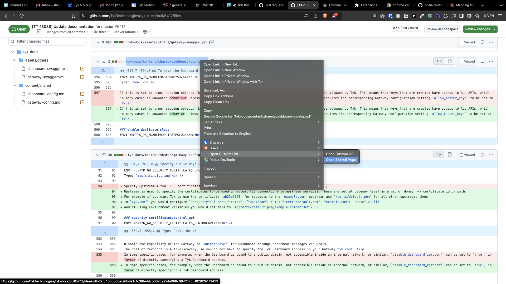
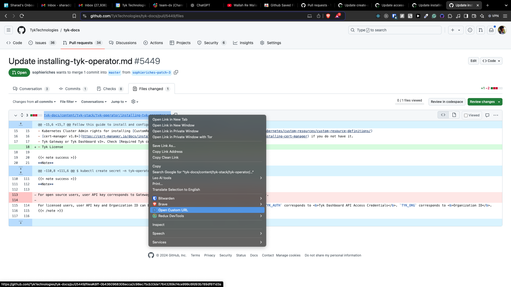

# open-custom-url-chrome-extension

# Installation
1. Download this repository locally
2. Open this URL in chrome `chrome://extensions`
3. Enable developer mode `Developer mode`
4. Click on `Load Unpacked` button & select the directory where this repository is downloaded.
5. You are good to go

# Usage

## Opening content inside /shared directory
1. Go to the `files changed` tab of any github pull request
2. Shared pages cannot be opened directly, as they are referenced using `{{< include` key in the markdown
3. This extension stores a mapping of all the referenced pages
4. Hover over the page link & right click on it
5. In the `contextMenu` you should see an option called `Open Shared URL`
6. Click on this option & it will open the all the referenced netlify deployment page.`

## Opening any other content
1. Go to the `files changed` tab of any github pull request
2. Hover over the page link & right click on it
3. In the `contextMenu` you should see an option called `Open Custom URL`
4. Click on this option & it will open the corresponding netlify deployment page.`

